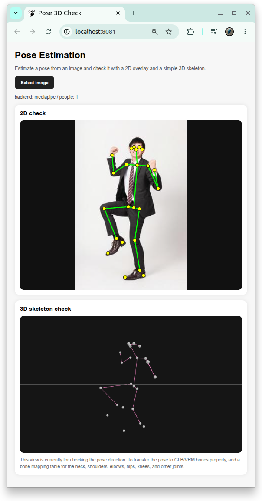

# [pose_estimation](https://github.com/europanite/pose_estimation "Ein Container für Posenschätzung aus 2D-Bildern.")

[](https://opensource.org/licenses/Apache-2.0)

[](https://www.python.org/)

[](https://github.com/europanite/pose_estimation/actions/workflows/codeql.yml)
[](https://github.com/europanite/pose_estimation/actions/workflows/ci.yml)
[](https://github.com/europanite/pose_estimation/actions/workflows/lint.yml)

<p align="right">
  <a href="https://europanite.github.io/pose_estimation/">🇺🇸 English</a> |
  <a href="https://europanite.github.io/pose_estimation/hi/">🇮🇳 हिंदी</a> |
  <a href="https://europanite.github.io/pose_estimation/ja/">🇯🇵 日本語</a> |
  <a href="https://europanite.github.io/pose_estimation/zh-CN/">🇨🇳 简体中文</a> |
  <a href="https://europanite.github.io/pose_estimation/es/">🇪🇸 Español</a> |
  <a href="https://europanite.github.io/pose_estimation/pt-BR/">🇧🇷 Português (Brasil)</a> |
  <a href="https://europanite.github.io/pose_estimation/ko/">🇰🇷 한국어</a> |
  <a href="https://europanite.github.io/pose_estimation/de/">🇩🇪 Deutsch</a> |
  <a href="https://europanite.github.io/pose_estimation/fr/">🇫🇷 Français</a>
</p>



> [!NOTE]
> Dies ist eine übersetzte Version des README. Die englische Version ist die maßgebliche Referenz.

Ein Container für Posenschätzung aus 2D-Bildern.

---

## Pose-to-VRM-Bone-Mapping

Das Backend gibt BODY_25-artige pose keypoints und bone pairs zurück. Im MediaPipe mode wird `Neck` aus `LShoulder` und `RShoulder` synthetisiert, und `MidHip` wird aus `LHip` und `RHip` synthetisiert. Verwende die folgende Tabelle, wenn du die geschätzte Pose auf ein VRM humanoid skeleton überträgst.

| Geschätzter Pose-Vektor | Eingabe-Keypoints | VRM humanoid bone | Priorität | Hinweise |
|---|---|---|---|---|
| Body root | `MidHip`, `LHip`, `RHip` | `hips` | Required | Hauptsächlich für root rotation verwenden. Verlasse dich bei einem einzelnen Bild nicht auf root translation. |
| Spine | `MidHip -> Neck` | `spine` | Required | Hauptrichtung des Oberkörpers. |
| Chest | `MidHip -> Neck` | `chest` | Recommended | Mit geringerem weight als `spine` anwenden, um übertriebenes Beugen zu vermeiden. |
| Upper chest | `MidHip -> Neck` | `upperChest` | Optional | Nur verwenden, wenn das geladene VRM model diesen bone besitzt. |
| Neck | `Neck -> Nose` | `neck` | Recommended | Vorsichtig anwenden, da head- und neck-landmarks bei Posenschätzung aus Einzelbildern verrauscht sind. |
| Head | `Neck -> Nose`, `Nose -> LEye`, `Nose -> REye`, `LEye -> LEar`, `REye -> REar` | `head` | Recommended | Ein simple fallback kann nur `Neck -> Nose` verwenden; eye und ear points können die Blickrichtung verbessern. |
| Left shoulder | `Neck -> LShoulder` | `leftShoulder` | Optional | Nur verwenden, wenn das VRM shoulder bones besitzt. Der arm kann auch ohne diesen bone gesteuert werden. |
| Left upper arm | `LShoulder -> LElbow` | `leftUpperArm` | Required | Primäre Rotation des linken Oberarms. |
| Left lower arm | `LElbow -> LWrist` | `leftLowerArm` | Required | Primäre Rotation des linken Unterarms. |
| Left hand | `LElbow -> LWrist` or hand landmarks | `leftHand` | Optional | BODY_25 liefert nicht genug wrist orientation. Verwende einen schwachen fallback, sofern keine hand landmarks verfügbar sind. |
| Right shoulder | `Neck -> RShoulder` | `rightShoulder` | Optional | Nur verwenden, wenn das VRM shoulder bones besitzt. |
| Right upper arm | `RShoulder -> RElbow` | `rightUpperArm` | Required | Primäre Rotation des rechten Oberarms. |
| Right lower arm | `RElbow -> RWrist` | `rightLowerArm` | Required | Primäre Rotation des rechten Unterarms. |
| Right hand | `RElbow -> RWrist` or hand landmarks | `rightHand` | Optional | BODY_25 liefert nicht genug wrist orientation. Verwende einen schwachen fallback, sofern keine hand landmarks verfügbar sind. |
| Left upper leg | `LHip -> LKnee` | `leftUpperLeg` | Required | Primäre Rotation des linken Oberschenkels. |
| Left lower leg | `LKnee -> LAnkle` | `leftLowerLeg` | Required | Primäre Rotation des linken Schienbeins. |
| Left foot | `LAnkle -> LBigToe`, `LAnkle -> LHeel` | `leftFoot` | Recommended | Verwende toe und heel points, wenn sie sichtbar sind. |
| Left toes | `LHeel -> LBigToe` | `leftToes` | Optional | Nur verwenden, wenn das VRM toe bones besitzt und die toe landmarks stabil sind. |
| Right upper leg | `RHip -> RKnee` | `rightUpperLeg` | Required | Primäre Rotation des rechten Oberschenkels. |
| Right lower leg | `RKnee -> RAnkle` | `rightLowerLeg` | Required | Primäre Rotation des rechten Schienbeins. |
| Right foot | `RAnkle -> RBigToe`, `RAnkle -> RHeel` | `rightFoot` | Recommended | Verwende toe und heel points, wenn sie sichtbar sind. |
| Right toes | `RHeel -> RBigToe` | `rightToes` | Optional | Nur verwenden, wenn das VRM toe bones besitzt und die toe landmarks stabil sind. |
| Left eye | `Nose -> LEye` | `leftEye` | Optional | Nur für gaze- oder expression-features erforderlich. |
| Right eye | `Nose -> REye` | `rightEye` | Optional | Nur für gaze- oder expression-features erforderlich. |

Die minimal nützlichen VRM bones sind `spine`, `leftUpperArm`, `leftLowerArm`, `rightUpperArm`, `rightLowerArm`, `leftUpperLeg`, `leftLowerLeg`, `rightUpperLeg` und `rightLowerLeg`. Wenn diese stabil sind, füge `hips`, `chest`, `neck`, `head`, `leftFoot` und `rightFoot` hinzu, um eine besser lesbare avatar pose zu erhalten.

---

## Projekt starten

```bash
cp .env.example .env
docker compose up --build
```

Browser öffnen:

```text
http://localhost:8081
```

API prüfen:

```bash
curl http://localhost:8000/api/v1/health
```

---

## Verwendung

1. Drücke "Select image".
2. Wähle eine image aus.
3. Prüfe die über der image eingeblendeten 2D keypoints.
4. Prüfe die pose direction in der unteren Ansicht "3D skeleton check".

## Tests

Backend tests ausführen:

```bash
docker compose -f docker-compose.test.yml run --rm backend_test
```

Frontend smoke test ausführen:

```bash
docker compose -f docker-compose.yml -f docker-compose.test.yml run --rm frontend_test
```

---

## License
- Apache License 2.0
