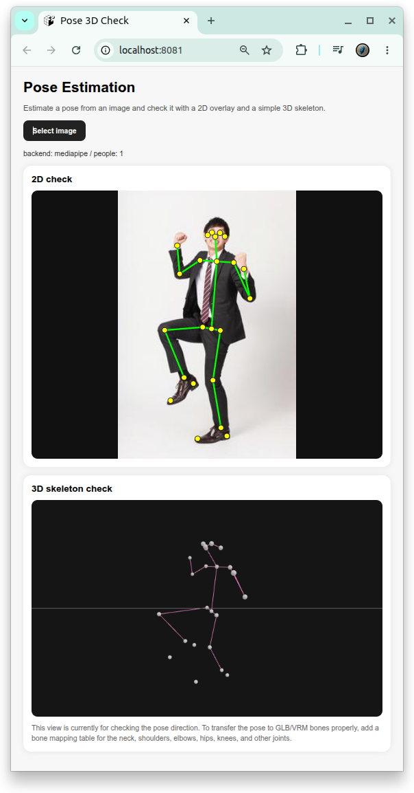

# [pose_estimation](https://github.com/europanite/pose_estimation "pose_estimation")

This is a Docker Compose project for loading an image, estimating the human pose, and checking the result with a 2D overlay and a simple 3D skeleton view.



## Summary

- Running OpenPose itself only inside a TypeScript + Expo frontend is not realistic.
- This project uses `POSE_BACKEND=mediapipe` so the basic flow can run reliably first.

## Start the project

```bash
cp .env.example .env
docker compose up --build
```

Open the browser:

```text
http://localhost:8081
```

Check the API:

```bash
curl http://localhost:8000/api/v1/health
```

## How to use

1. Press "Select image".
2. Select an image.
3. Check the 2D keypoints overlaid on the image.
4. Check the pose direction in the lower "3D skeleton check" view.
